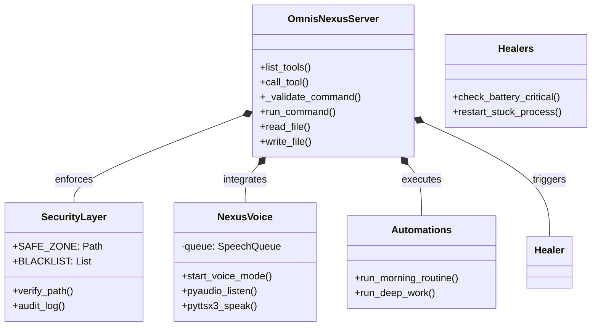
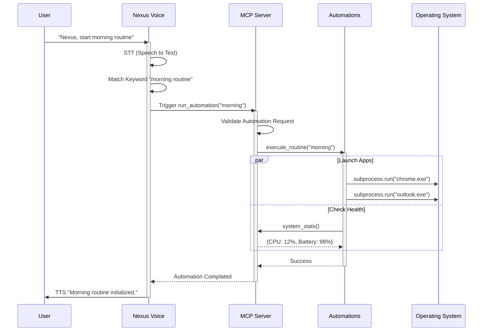

# Omnis-Nexus Project Architecture & Diagrams

This document visualizes the structure and validation flow of the Omnis-Nexus system.

## 1. High-Level System Architecture

This diagram illustrates how Omnis-Nexus fits into the broader ecosystem, bridging the gap between the LLM (Claude) and the Operating System.

```mermaid
graph TD
    subgraph "User Layer"
        User[User / Operator]
        Voice[Mic / Voice Input]
    end

    subgraph "Interface Layer"
        Claude[Claude Desktop / LLM]
        MCP[Omnis-Nexus MCP Server]
    end

    subgraph "Core Logic (Omnis Nexus)"
        Server[omnis_nexus_server.py]
        Config[Config & Security<br/>(config.json / Env)]
        
        subgraph "Expansion Pack"
            NexusVoice[Nexus Voice Module]
            Auto[Automation Routines]
            Healer[Sentinel Healers]
        end
    end

    subgraph "OS Abstraction Layer"
        Shell[Shell / Terminal]
        FS[File System]
        Input[Mouse / Keyboard]
        Vision[Screen Capture]
        Proc[Process Manager]
    end

    %% Connections
    User -->|Text Prompts| Claude
    User -->|Voice Commands "Nexus..."| Voice
    Voice -->|Audio| NexusVoice
    
    Claude <-->|JSON-RPC 2.0| MCP
    MCP --> Server
    
    Server -->|Imports| NexusVoice
    Server -->|Imports| Auto
    Server -->|Imports| Healer
    Server -.->|Reads| Config

    Server -->|Execute| Shell
    Server -->|Read/Write| FS
    Server -->|Control| Input
    Server -->|See| Vision
    Server -->|Manage| Proc
    NexusVoice -->|Triggers| Auto
```

## 2. Component Structure (Container Diagram)

A detailed look at the internal components of the Omnis-Nexus Python codebase.



## 3. Operational Workflow (Sequence Diagram)

Example: **"Morning Routine"** execution flow via Voice Command.


