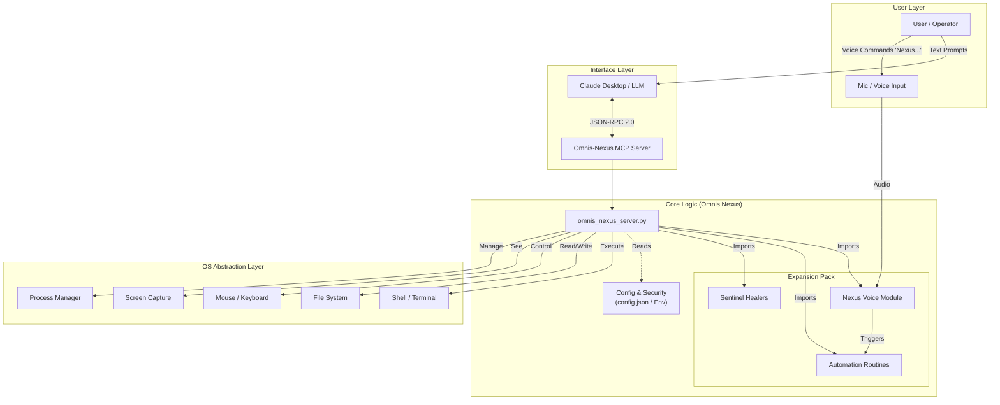
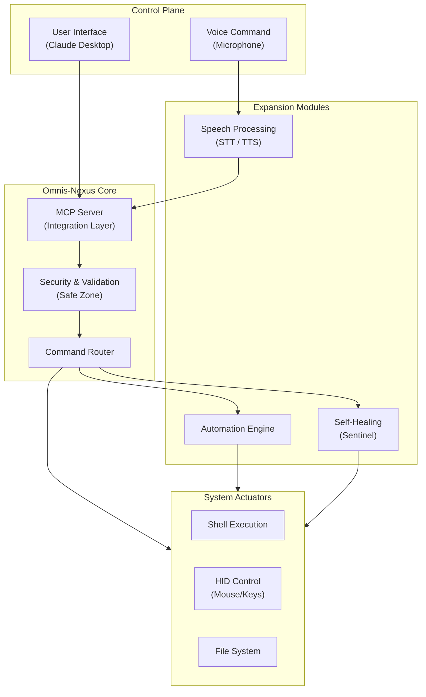

# Omnis-Nexus Project Architecture & Diagrams

This document visualizes the structure and validation flow of the Omnis-Nexus system.

## 1. High-Level System Architecture

This diagram illustrates how Omnis-Nexus fits into the broader ecosystem, bridging the gap between the LLM (Claude) and the Operating System.

## 2. Component Structure (Container Diagram)

A detailed look at the internal components of the Omnis-Nexus Python codebase.

## 3. Operational Workflow (Sequence Diagram)

Example: **"Morning Routine"** execution flow via Voice Command.

## 4. Functional Block Diagram

Block-level view of system modules, data flow, and control signals.

